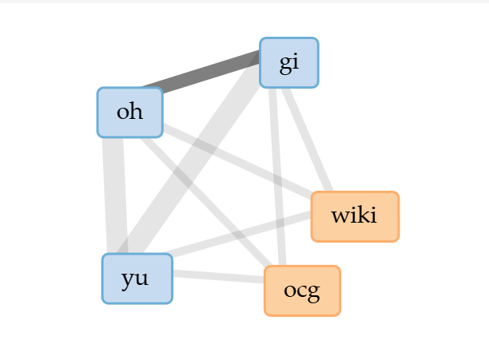



# Distant Reading Assignment 

I used this website to do my research! [Yu-Gi-Oh Website] (https://yugioh.fandom.com/wiki/Yu-Gi-Oh!_Wiki) 

What ive learned from Voyant is that there are a lot of cards in the Yu-Gi-Oh and as well as their different generations of yu gi oh spending from From the 
first series to now many different series  

Check out the image

---
I also tried Copilot with ChatGPT 5 

how many cards are there in Yu-Gi-Oh?

As of 2023, there are **over 10,000 officially recognized Yu-Gi-Oh! cards** across the TCG (Trading Card Game) and OCG (Official Card Game). The game adds roughly **400–800 new cards every year**, so by 2025, the total is projected to be around **12,000–12,500 cards**[1](https://expertbeacon.com/how-many-yugioh-cards-are-there/).

how many sets and types are there 

Here’s a detailed breakdown of **Yu-Gi-Oh! sets, card types, and archetypes**:

---

### ✅ **Number of Sets**
- There are **over 836 official sets** (including booster packs, starter decks, structure decks, and promotional sets) released worldwide as of 2023, and the number continues to grow each year[1](https://expertbeacon.com/how-many-yu-gi-oh-card-sets-are-there/).

---

### ✅ **Card Types**
Yu-Gi-Oh! cards are divided into **three main categories**:
1. **Monster Cards** (tan/brown background)
   - **Normal Monsters**: No effects, just ATK/DEF stats.
   - **Effect Monsters**: Have special abilities.
   - **Special Monster Types**:
     - **Fusion** (purple)
     - **Ritual** (blue)
     - **Synchro** (white)
     - **Xyz** (black)
     - **Pendulum** (half-green)
     - **Link** (dark blue)
2. **Spell Cards** (green background)
   - Subtypes: Normal, Continuous, Field, Equip, Quick-Play, Ritual.
3. **Trap Cards** (purple background)
   - Subtypes: Normal, Continuous, Counter[2](https://www.tcgplayer.com/content/article/What-Are-The-Card-Types-in-Yu-Gi-Oh/c0026840-67f9-4401-af15-7d5677c317ee/)[3](https://www.dicebreaker.com/games/yu-gi-oh-tcg/how-to/yu-gi-oh-card-types-explained).

---

### ✅ **Number of Archetypes**
- There are **over 250 officially recognized archetypes** in the game, ranging from classics like **Blue-Eyes**, **Dark Magician**, and **Elemental HERO** to modern ones like **Branded**, **Drytron**, and **Spright**[4](https://yugioh.fandom.com/wiki/Category:Archetypes).

---

🔥 **Summary Table**

| Category       | Count / Details |
|---------------|-----------------|
| **Total Sets** | 836+ |
| **Card Types** | Monster, Spell, Trap (with many subtypes) |
| **Archetypes** | 250+ |

---

Here is a fun link to a [Markdown Cheatsheet](https://www.markdownguide.org/cheat-sheet/). Once you grasp the basics here, go add "Markdown" to your list of skills on your resume!
